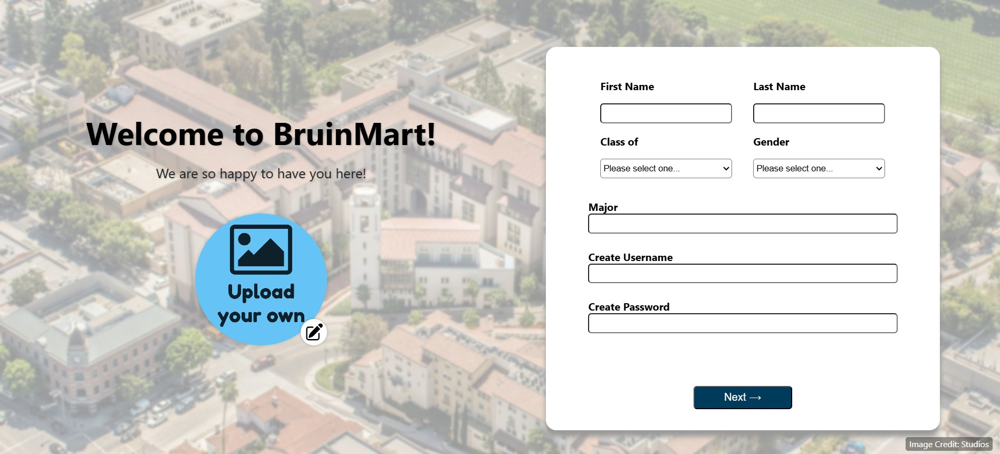
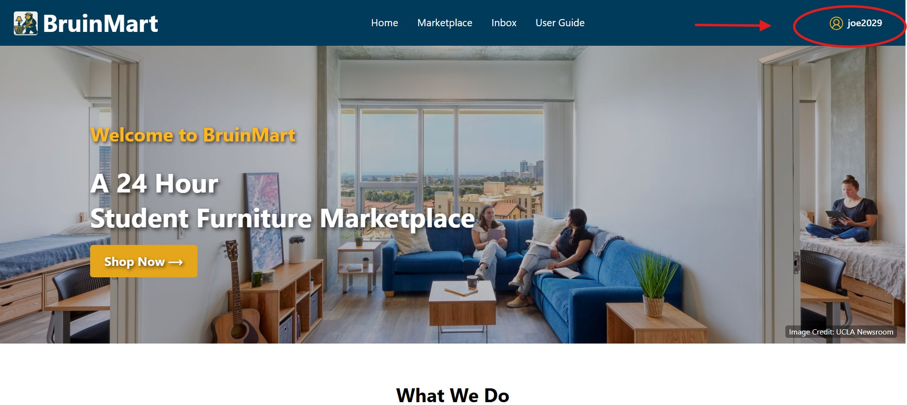
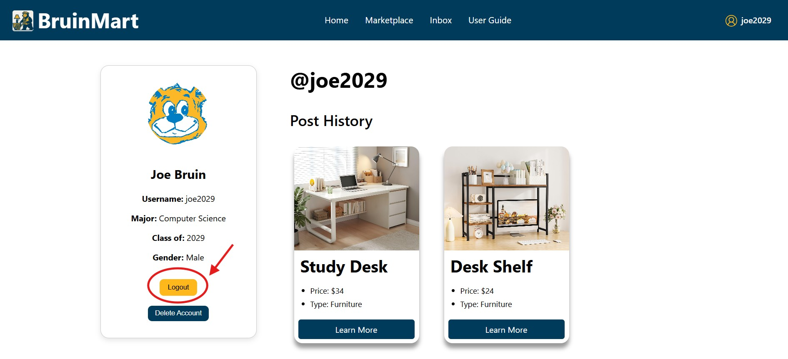
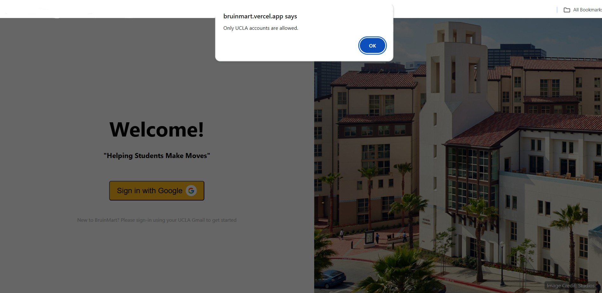

# Welcome to BruinMart 🐻

**Explore BruinMart 👉 [here](https://bruinmart.vercel.app)**

BruinMart was built by UCLA students, for UCLA students to simplify buying and selling within our community while keeping it secure and reliable.

As students, we know how difficult it can be to find affordable furniture, textbooks, or everyday essentials, especially with the presence of untrustworthy sellers and inflated prices. Public platforms often feel risky, leaving you guessing about who’s on the other side of a transaction.

That’s why we created BruinMart: a platform exclusively for UCLA students and alumni, where every user is verified, every transaction is protected, and every exchange is designed to give you peace of mind. No scams, no sketchy meetups—just Bruins helping Bruins.

## Get Started as Users

1. Go to [bruinmart.vercel.app](https://bruinmart.vercel.app)
2. Click “Login/Sign Up” to sign in with your UCLA or g.ucla.edu email.

3. New users will be prompted to complete their profile.

4. Once verified, you can browse listings and contact sellers.

***
**Steps to Log Out / Delete Account**
1. Navigate to the Profile page
2. Click on the Logout Button or Delete Account

## Features
- UCLA-only sign-in via Google Authentication

- Browse and listings for furniture, books, and more
- Responsive UI for desktop
- Listing detail pop-up with price/type
- Account deletion and email verification

## Tech Stack

- React.js
- Firebase (Authentication + Firestore)
- Vercel (Hosting)
